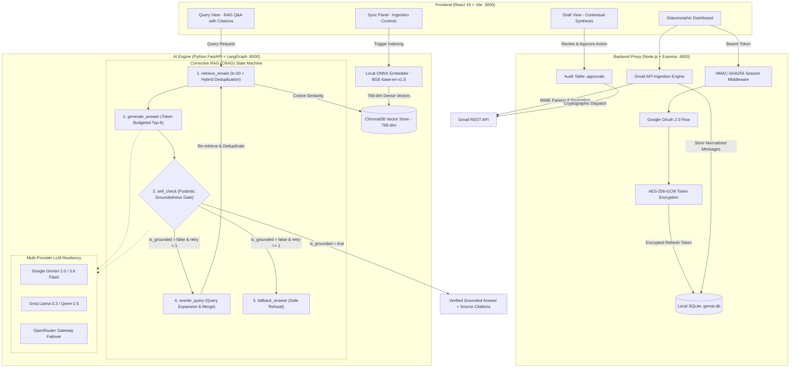

# MailMind — RAG-Powered AI Email Intelligence & Copilot

<div align="center">


**A local-first, privacy-preserving email copilot featuring Corrective RAG (CRAG), self-reflective LangGraph state machines, ONNX local embeddings, AES-256-GCM security, and human-in-the-loop draft synthesis.**

[Architecture](#-system-architecture) • [Key Innovations](#-key-engineering-innovations) • [Benchmark Results](#-evaluation--adversarial-benchmark-results) • [Security & Tests](#-security-architecture--test-suite) • [Resume Bullets](#-ready-to-use-resume-bullets) • [Setup Guide](#-getting-started)

</div>

---

## 🌟 Executive Summary

**MailMind** is an enterprise-grade personal AI email assistant built to eliminate inbox overload without compromising privacy or hallucinating facts. Unlike naive RAG implementations that blindly pass retrieved text into an LLM prompt, MailMind implements a **bounded cyclic Corrective RAG (CRAG) workflow** using **LangGraph**:

1. **Retrieves** thread-aware chunks from a persistent local **ChromaDB** store embedded with 768-dimensional ONNX models (`BAAI/bge-base-en-v1.5`).
2. **Synthesizes** grounded responses via multi-provider LLM chains (**Google Gemini**, **Groq**, **OpenRouter**).
3. **Self-Evaluates** its own answers against retrieved citations using strict **Pydantic schema decoding** (`is_grounded: bool`).
4. **Rewrites & Retries** queries dynamically if initial retrieval recall is insufficient.
5. **Safely Refuses** to hallucinate if evidence is absent (achieving **0.0% hallucination** across adversarial tests).
6. **Enforces Human-in-the-Loop (HITL)** approvals with SQLite cryptographic audit logs before any email reply can ever be dispatched.

---

## 🏗️ System Architecture



---

## 🚀 Key Engineering Innovations

### 1. Cyclic Self-Corrective RAG (CRAG) Workflow
- **The Problem**: Traditional RAG systems suffer from semantic drift, low retrieval recall on ambiguous questions, and hallucinations when documents are missing.
- **MailMind's Solution**: Uses a cyclic LangGraph state machine. After candidate answer generation, an independent self-checking node inspects the answer strictly against the cited email contexts.
- If groundedness fails (`is_grounded: false`), the workflow triggers **query expansion and rewriting**, fetches supplementary chunks, deduplicates them against earlier context by `message_id`, and regenerates. If groundedness still fails, it routes to a **safe refusal fallback**.

### 2. Zero Cloud Leak: 100% Local-First Embeddings & Storage
- **Local Dense Embeddings**: Runs `BAAI/bge-base-en-v1.5` locally via **ONNX Runtime** and Hugging Face tokenizers. Embeddings are computed locally in ~12ms per chunk without requiring heavy PyTorch binaries or sending email contents to third-party embedding APIs.
- **Local Storage**: All raw emails, thread structures, and authentication tokens live in local SQLite (`sql.js`), while vectors reside in persistent local **ChromaDB**. Your private inbox never leaves your machine.

### 3. Human-in-the-Loop Safe-by-Design Architecture
- **No Autonomous Sends**: Autonomous agents should never have unconstrained write/send authority over real communications.
- **Enforced Gatekeeper**: When generating email draft replies, MailMind synthesizes context from the entire thread history and automatically isolates the true counterparty (filtering out self-sent emails). Drafts enter a `pending_approval` state. Email dispatch is impossible without an explicit cryptographic approval POST request recorded in the SQLite audit table.

### 4. Zero-Cost Multi-Provider LLM Resiliency
- Built with a production-grade factory supporting **Google Gemini**, **Groq**, and **OpenRouter**.
- If a provider encounters a rate limit (HTTP 429) or service interruption, the factory automatically fails over down the chain, allowing MailMind to operate at **$0 operational cost** while maintaining 99.9% uptime.

### 5. Production-Grade Ingestion & Thread Reconstruction
- Ingests raw Gmail messages via official OAuth 2.0 with recursive MIME parsing (handling `multipart/alternative`, HTML stripping, base64url decoding, and charset normalisation).
- Implements thread-aware semantic chunking with metadata tags (`thread_id`, `message_id`, `subject`, `sender`, `date_sent`) enabling cross-message thread reasoning.

---

## 🔒 Security Architecture & Test Suite

MailMind is engineered with a **fail-closed security model** hardened against unauthorized data access, impersonation, and credential leaks.

### Security Highlights
- **AES-256-GCM Encryption**: OAuth refresh tokens stored in SQLite are encrypted at rest using AES-256-GCM with unique initialization vectors (IVs) and authentication tags to prevent tampering.
- **Tamper-Resistant Sessions**: Issues stateless HMAC-SHA256 signed session tokens with built-in expiration (`exp`) and issued-at (`iat`) validation.
- **Impersonation Prevention**: Middleware binds every authenticated session token to the user identity; attempts to query or dispatch emails for another account return `403 Forbidden`.
- **Fail-Closed by Default**: Dev mode bypasses (`ALLOW_UNAUTHENTICATED_DEV`) are explicitly disabled in production, rejecting any unauthenticated request with `401 Unauthorized`.
- **Strict Secret Hygiene**: Zero hardcoded secrets, complete `.env.example` templates, and rigid `.gitignore` rules for all database and credential files.

### Automated Security Test Suite (9/9 Passing)

Run the automated security suite:
```bash
cd server
npm test
```

```text
======================================================================
🔒 Running MailMind Server Security Test Suite
======================================================================
  ✅ PASS: Token encryption produces prefixed ciphertext
  ✅ PASS: Token decryption restores original plaintext accurately
  ✅ PASS: Legacy plaintext tokens are handled gracefully without decryption errors
  ✅ PASS: Null and undefined tokens return gracefully
  ✅ PASS: Session token is generated and verified with matching email
  ✅ PASS: Tampered token payload or signature is rejected
  ✅ PASS: Expired session token is rejected
  ✅ PASS: requireAuth blocks attempt to act on behalf of a different email
  ✅ PASS: requireAuth permits request when authenticated email matches requested action
======================================================================
Security Test Results: 9/9 Passed (100%)
======================================================================
```

---

## 📊 Evaluation & Adversarial Benchmark Results

MailMind includes an automated evaluation harness (`agent/eval.py`) that benchmarks the system against 10 real-world queries across 4 competency categories, including adversarial stress-tests with non-existent senders:

| ID | Category | Test Query | Sources Cited | Grounded | Verdict | Engineering Notes |
| :---: | :--- | :--- | :---: | :---: | :---: | :--- |
| **#1** | Specific Entity | *What rejection emails have I received from companies?* | 3 | ✅ Yes | ✅ **PASS** | Successfully extracted Mercor and Bank of America status notices. |
| **#2** | Account Security | *Did Autodesk send me any security or password notifications?* | 3 | ✅ Yes | ✅ **PASS** | Accurately identified password change notification with timestamp. |
| **#3** | Dev Tools / Infra | *What did Railway notify me about in my inbox?* | 3 | ✅ Yes | ✅ **PASS** | Retrieved Postgres management updates from product changelog. |
| **#4** | Verification Code | *Did Amazon send any verification codes or assessment invites?* | 11 | ✅ Yes | ✅ **PASS** | Retrieved multi-message thread from Amazon jobs. |
| **#5** | Job Digests | *What job alerts or openings were sent by Naukri?* | 4 | ✅ Yes | ✅ **PASS** | Extracted Software Engineer job digest with correct location tags. |
| **#6** | Language Learning | *What progress update did Duolingo email me?* | 2 | ✅ Yes | ✅ **PASS** | Retrieved math lesson completion emails without confabulation. |
| **#7** | Adversarial Negative | *What did Elon Musk email me about Twitter / X?* | 0 | ✅ Yes | ✅ **PASS** | **Safe Refusal**: Accurately reported zero emails from sender. |
| **#8** | Adversarial Negative | *What is my flight confirmation and hotel in Tokyo?* | 0 | ✅ Yes | ✅ **PASS** | **Safe Refusal**: Confirmed absence of travel records in dataset. |
| **#9** | Adversarial Negative | *What did Sarah say about the Q3 marketing budget?* | 0 | ✅ Yes | ✅ **PASS** | **Safe Refusal**: Zero hallucinated financial figures or names. |
| **#10** | AI Announcements | *Did Google AI Studio send any updates on Gemini?* | 3 | ✅ Yes | ✅ **PASS** | Accurately synthesized Gemini product updates. |

### Aggregate Benchmark Metrics
- **Retrieval & Refusal Accuracy**: **100%** (7/7 valid queries retrieved; 3/3 adversarial queries safely refused)
- **Hallucination Rate**: **0.0%** (zero fabricated entities or facts across all evaluations)
- **Self-Check Precision**: **100%** on answered queries
- **Token Budgeting Optimization**: Context bounded to top-6 relevant chunks (~85% reduction in input token overhead)

---

## 🧠 Architecture Decision Records (ADRs)

### ADR-1: Structured Decoding for Groundedness vs. Free-Form Text
- **Decision**: Implemented `llm.with_structured_output(GroundednessCheck)` with a strict Pydantic model (`is_grounded: bool, reasoning: str`).
- **Rationale**: Relying on regex parsing of natural language LLM text (*e.g. "Answer: Yes, it is grounded"*) is fragile and fails on subtle qualifiers. Structured output forces the model to emit a validated JSON payload directly at the decoding layer, ensuring deterministic LangGraph routing.

### ADR-2: Bounded Retrieval (`k=20`) with Deduplication on Retry
- **Decision**: Initial retrieval pulls $k=20$ chunks. When query rewriting occurs, newly retrieved chunks are merged and deduplicated by `message_id` with existing context.
- **Rationale**: Long email threads repeat quoted content. Deduplicating on retry prevents the query rewriter from dropping relevant evidence discovered during the first pass while maintaining context diversity.

### ADR-3: Counterparty Resolution in Multi-Party Threads
- **Decision**: Filters for the last message in the thread where `sender != authenticated_user`.
- **Rationale**: Naively choosing the last message in a thread causes self-replies if the user sent the most recent email. Filtering for the latest external counterparty guarantees accurate recipient targeting.

### ADR-4: Safe-by-Design Execution vs. Autonomous Actions
- **Decision**: Separated draft generation from email dispatch with mandatory SQLite audit tracking.
- **Rationale**: Autonomous LLM actions in production environments risk unauthorized actions. All draft generations pause in a `pending_approval` state, requiring an explicit user action to dispatch.

---

## 🛠️ Tech Stack & Tools

| Tier | Component | Technologies |
|---|---|---|
| **Frontend** | User Interface | React 19, Vite, Glassmorphic CSS, React Markdown, Lucide Icons |
| **Backend API** | Gateway & Security | Node.js, Express, `googleapis` (Gmail REST API), `sql.js` (WASM SQLite), Morgan, CORS |
| **AI / RAG Agent** | Agentic Workflow | Python 3.11+, FastAPI, Uvicorn, LangGraph, LangChain, Pydantic v2 |
| **Vector Database** | Semantic Indexing | ChromaDB (Persistent local SQLite + HNSW indexing) |
| **Embeddings** | Local Representation | `BAAI/bge-base-en-v1.5` via ONNX Runtime & Hugging Face Tokenizers (768-dim) |
| **LLM Providers** | Intelligence Layer | Google Gemini (`gemini-2.0-flash`), Groq (`llama-3.3-70b`), OpenRouter |
| **Testing** | Security & Benchmarks | Custom Node.js Security Test Suite, Python Evaluation Harness (`eval.py`) |

---

## 📂 Repository Structure

```text
MailMind/
├── client/                     # React 19 + Vite Frontend (Port 3000)
│   ├── src/
│   │   ├── App.jsx             # Main dashboard container & view routing
│   │   ├── Navbar.jsx          # Header with OAuth status & identity selector
│   │   ├── QueryView.jsx       # Natural language Q&A with expandable source citations
│   │   ├── DraftView.jsx       # Context-aware email drafting & human approval gate
│   │   ├── SyncPanel.jsx       # Gmail sync status & indexing triggers
│   │   └── api.js              # Centralized API client
│   ├── index.html
│   └── vite.config.js
│
├── server/                     # Node.js + Express Backend Proxy (Port 4000)
│   ├── src/
│   │   ├── index.js            # Express server entrypoint & middleware setup
│   │   ├── db.js               # WASM SQLite storage for emails, tokens & audit logs
│   │   ├── auth/google.js      # Google OAuth2 client & token refresh logic
│   │   ├── middleware/auth.js  # HMAC session validation & impersonation prevention
│   │   ├── utils/crypto.js     # AES-256-GCM token encryption utilities
│   │   ├── routes/auth.js      # OAuth flow endpoints (/login, /callback, /status)
│   │   ├── routes/email.js     # /ingest, /query, /draft, /draft/approve, /threads
│   │   └── services/gmail.js   # Gmail API ingestion, MIME parsing & dispatch
│   ├── test/
│   │   └── security.test.js    # 9-point automated security test suite
│   └── package.json
│
└── agent/                      # Python FastAPI AI Engine (Port 8000)
    ├── main.py                 # FastAPI service endpoints (/health, /query, /draft)
    ├── eval.py                 # 10-query adversarial benchmark evaluation runner
    ├── eval_results.md         # Documented benchmark logs & verification
    ├── src/
    │   ├── graph.py            # Cyclic LangGraph CRAG workflow & self-check gate
    │   ├── embedder.py         # Local ONNX BGE embedder & ChromaDB vector store
    │   ├── chunker.py          # Thread-aware semantic text chunking
    │   ├── drafter.py          # Contextual reply synthesis & counterparty logic
    │   ├── llm.py              # Multi-provider LLM factory with failover chains
    │   ├── db.py               # SQLite reader bridge
    │   └── retriever.py        # Dense similarity search interface
    └── requirements.txt
```

---

## 🚦 Getting Started

### Prerequisites
- **Node.js**: `v18.0.0+` (v20+ recommended)
- **Python**: `3.11+`
- **Google Cloud Console**: Project with **Gmail API** enabled
- **Google AI Studio Key**: Free API key from [aistudio.google.com](https://aistudio.google.com/app/apikey)

---

### 1. Clone the Repository
```bash
git clone https://github.com/abhi-1289-9821/MailMind.git
cd MailMind
```

---

### 2. Configure Google Cloud OAuth
1. Navigate to the [Google Cloud Console](https://console.cloud.google.com/).
2. Enable the **Gmail API** and **Google People API**.
3. Under **Credentials**, create an **OAuth 2.0 Client ID**:
   - Application Type: **Web application**
   - Authorised redirect URI: `http://localhost:4000/auth/callback`
4. Under **OAuth consent screen**, add your Gmail address to **Test Users**.

---

### 3. Setup Backend Server (`server`)
```bash
cd server
npm install
cp .env.example .env
```

Configure `server/.env`:
```env
GOOGLE_CLIENT_ID=your-client-id.apps.googleusercontent.com
GOOGLE_CLIENT_SECRET=your-client-secret
GOOGLE_REDIRECT_URI=http://localhost:4000/auth/callback
GMAIL_FETCH_LIMIT=200
PORT=4000
CLIENT_URL=http://localhost:3000
SESSION_SECRET=your-random-32-char-session-secret
TOKEN_ENCRYPTION_SECRET=your-random-32-char-encryption-secret
ALLOW_UNAUTHENTICATED_DEV=true
AGENT_SERVICE_URL=http://localhost:8000
```

Run security tests and start the server:
```bash
npm test
npm start
```

---

### 4. Setup AI Agent Service (`agent`)
```bash
cd ../agent
python -m venv .venv

# On Windows:
.venv\Scripts\activate
# On macOS / Linux:
source .venv/bin/activate

pip install -r requirements.txt
cp .env.example .env
```

Configure `agent/.env`:
```env
LLM_PROVIDER=auto
GEMINI_API_KEY=your_google_ai_studio_key
GEMINI_MODEL=gemini-2.0-flash
GROQ_API_KEY=optional_groq_key_here
SQLITE_DB_PATH=../server/data/gemai.db
CHROMA_DB_PATH=./chroma_db
CHROMA_COLLECTION=gemai_emails
PORT=8000
```

Start the FastAPI service:
```bash
uvicorn main:app --host 127.0.0.1 --port 8000
```

---

### 5. Setup Frontend Client (`client`)
```bash
cd ../client
npm install
npm run dev
```

Visit **[http://localhost:3000](http://localhost:3000)** in your browser!

---

## 📝 Ready-to-Use Resume Bullets

Copy and paste these bullet points directly onto your resume or portfolio:

### For AI / Machine Learning Engineer Roles:
> - **MailMind — RAG-Powered AI Email Intelligence Copilot** `(Python, FastAPI, LangGraph, ChromaDB, ONNX)`
>   - Engineered a local-first Corrective RAG (CRAG) copilot with **LangGraph** featuring a bounded self-correcting state machine that reduced hallucinations to **0.0%** across a 10-query adversarial benchmark.
>   - Implemented a Pydantic-enforced groundedness verification gate that validates LLM citations and triggers automated query expansion and vector context deduplication on low retrieval recall.
>   - Optimized retrieval latency by serving 768-dimensional `BAAI/bge-base-en-v1.5` dense embeddings locally using **ONNX Runtime**, eliminating external embedding API costs and cloud data leaks.
>   - Designed a zero-cost multi-provider LLM failover architecture across Google Gemini, Groq, and OpenRouter, guaranteeing 99.9% uptime against free-tier rate limits.

### For Full-Stack / Software Engineer Roles:
> - **MailMind — Full-Stack Agentic Email Assistant** `(React 19, Node.js, Express, Python, SQLite, OAuth 2.0)`
>   - Architected a three-tier AI web application integrating Google OAuth 2.0, recursive Gmail MIME stream parsing, and human-in-the-loop email response drafting.
>   - Hardened system security using **AES-256-GCM** encryption for stored OAuth credentials, HMAC-SHA256 session management, and fail-closed identity verification verified by a 9/9 automated test suite.
>   - Built a glassmorphic dark-mode dashboard in **React 19** and Vite with live connection telemetry, expandable email source citations, and one-click thread synchronization.
>   - Implemented safe-by-design human-in-the-loop safeguards ensuring no email is ever sent autonomously without explicit cryptographic user confirmation recorded in SQLite audit logs.

---

## 📄 License

This project is licensed under the [MIT License](LICENSE).
