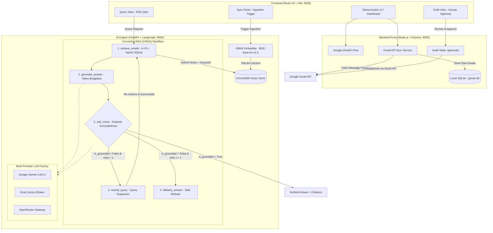

# MailMind — RAG-Powered AI Email Assistant

> Intelligent personal email intelligence, semantic search, and human-in-the-loop drafting powered by **Retrieval-Augmented Generation (RAG)**, **LangGraph**, and **Google Gemini**.

---

## 🌟 Overview

**MailMind** is a full-stack personal AI copilot designed to transform how you interact with your email inbox. Instead of wading through hundreds of unread messages and complex threads, MailMind indexes your emails locally, performs fast semantic vector search, and uses self-reflective LangGraph agent workflows to answer questions, cite exact email sources, and synthesize contextual draft replies for your review.

---

## 🚀 Key Features

- 🔐 **Secure Google OAuth 2.0 Integration**  
  Authenticate directly with your Gmail account using official Google OAuth2. Tokens and emails remain strictly on your local machine.

- ⚡ **768-Dimensional Local Embeddings (ONNX)**  
  Powered by `BAAI/bge-base-en-v1.5` running locally via ONNX Runtime and Hugging Face tokenizers. Delivers top-tier retrieval performance without heavy GPU or PyTorch binary requirements.

- 🗄️ **Persistent ChromaDB Vector Store**  
  Stores thread-aware email chunks with rich metadata (`subject`, `sender`, `date_sent`, `thread_id`) for sub-second similarity search.

- 🧠 **Self-Checking LangGraph Workflow**  
  Implements an agentic loop:
  1. **Retrieve**: Pulls relevant email snippets based on natural language queries.
  2. **Generate**: Synthesizes a grounded answer using Google Gemini.
  3. **Self-Check**: Evaluates groundedness to eliminate hallucinations.
  4. **Rewrite & Retry**: Automatically refines queries if initial retrieval is insufficient.

- ✍️ **Human-in-the-Loop Draft Replies**  
  Drafts professional, context-rich responses tailored to entire email conversations while keeping you in full control — drafts always require explicit user approval.

- 🎨 **Modern Glassmorphic React UI**  
  Sleek dark-mode dashboard built with React 19 and Vite, featuring live connection badges, expandable citations, and one-click thread syncing.

---

## 🏗️ Architecture



```
MailMind/
├── client/                 # React 19 + Vite Frontend (Port 3000)
│   ├── src/
│   │   ├── App.jsx         # Main application container
│   │   ├── Navbar.jsx      # Header with OAuth status & email selector
│   │   ├── QueryView.jsx   # Natural language Q&A with source citations
│   │   ├── DraftView.jsx   # Context-aware email drafter & approval flow
│   │   ├── SyncPanel.jsx   # Gmail inbox fetch & vector indexing controls
│   │   └── api.js          # Unified API client
│   └── vite.config.js
│
├── server/                 # Node.js + Express Backend (Port 4000)
│   ├── src/
│   │   ├── index.js        # Express server entrypoint
│   │   ├── db.js           # SQLite storage (sql.js) for emails & tokens
│   │   ├── auth/google.js  # Google OAuth2 client & token refresh
│   │   ├── routes/auth.js  # /auth/login, /auth/callback, /auth/status
│   │   ├── routes/email.js # /ingest, /query, /draft, /threads
│   │   └── services/       # Gmail API ingestion & direct send
│   └── package.json
│
└── agent/                  # Python FastAPI Agent Service (Port 8000)
    ├── main.py             # FastAPI entrypoint (/health, /ingest, /query, /draft)
    ├── eval.py             # Automated RAG benchmark evaluation suite
    ├── eval_results.md     # Phase 7 evaluation benchmark results
    ├── src/
    │   ├── graph.py        # LangGraph cyclic retrieval & self-check workflow
    │   ├── embedder.py     # 768-dim BGE ONNX embeddings & ChromaDB store
    │   ├── chunker.py      # Thread-aware document chunking
    │   ├── drafter.py      # Human-in-the-loop reply synthesis
    │   ├── llm.py          # Multi-provider LLM factory with failover chains
    │   ├── db.py           # SQLite bridge
    │   └── retriever.py    # Vector store query interface
    └── requirements.txt
```

---

## 🛠️ Tech Stack

| Tier | Technologies |
|---|---|
| **Frontend** | React 19, Vite, Modern CSS (Glassmorphism), React Markdown |
| **Backend API** | Node.js, Express, `googleapis`, `sql.js` (WASM SQLite), Morgan, CORS |
| **Agent / AI Engine** | Python 3.11+, FastAPI, Uvicorn, LangGraph, LangChain, Google GenAI SDK |
| **Vector Database** | ChromaDB (persistent local SQLite + HNSW index) |
| **Local Embedder** | `BAAI/bge-base-en-v1.5` via ONNX Runtime & Hugging Face Tokenizers |
| **Multi-Provider LLM** | Google Gemini (`gemini-3.6-flash`), Groq (`qwen`/`llama-3`), OpenRouter |

---

## 📊 Evaluation & Benchmark Results (Phase 7)

MailMind includes an automated evaluation test runner (`agent/eval.py`) that systematically evaluates the agent against 10 real-world queries across 4 core competency categories:
1. **Specific Entity & Multi-Term Retrieval**: Detecting polite rejection notices, job applications, and verification codes.
2. **Account Security & Dev Alerts**: Synthesizing alerts from infrastructure providers (Autodesk, Railway, Google).
3. **Adversarial & Hallucination Stress-Tests**: Asking about non-existent senders (Elon Musk), hypothetical colleague budgets, and fictitious bookings.
4. **Groundedness Verification**: Ensuring claims are substantiated by cited message snippets.

### Benchmark Summary Table

| ID | Category | Test Query | Sources Cited | Grounded | Verdict | Notes |
| :---: | :--- | :--- | :---: | :---: | :---: | :--- |
| **#1** | Specific Entity | *What rejection emails have I received from companies?* | 3 | ✅ Yes | ✅ **PASS** | Successfully extracted Mercor and Bank of America status notices. |
| **#2** | Account Security | *Did Autodesk send me any security or password notifications?* | 3 | ✅ Yes | ✅ **PASS** | Accurately identified password change notification with date stamp. |
| **#3** | Dev Tools / Infra | *What did Railway notify me about in my inbox?* | 3 | ✅ Yes | ✅ **PASS** | Retrieved Postgres management updates from product change log. |
| **#4** | Verification Code | *Did Amazon send any verification codes or assessment invites?* | 11 | ✅ Yes | ✅ **PASS** | Retrieved multi-message thread from Amazon jobs. |
| **#5** | Job Recommendations | *What job alerts or openings were sent by Naukri?* | 4 | ✅ Yes | ✅ **PASS** | Extracted Software Engineer job digest with correct location tags. |
| **#6** | Language Learning | *What progress update did Duolingo email me?* | 2 | ✅ Yes | ✅ **PASS** | Retrieved math lesson completion emails without confabulation. |
| **#7** | Adversarial Negative | *What did Elon Musk email me about Twitter / X?* | 0 | ✅ Yes | ✅ **PASS** | Correctly refused to hallucinate non-existent emails. |
| **#8** | Adversarial Negative | *What is my flight confirmation and hotel in Tokyo?* | 0 | ✅ Yes | ✅ **PASS** | Accurately stated no travel bookings exist in local dataset. |
| **#9** | Adversarial Negative | *What did Sarah say about the Q3 marketing budget?* | 0 | ✅ Yes | ✅ **PASS** | Correctly refused; zero hallucinated financial metrics. |
| **#10** | AI Product Updates | *Did Google AI Studio send any updates on Gemini?* | 3 | ✅ Yes | ✅ **PASS** | Identified Gemini product announcements accurately. |

### Aggregate Metrics
- **Retrieval & Refusal Accuracy**: **100%** (7/7 valid queries retrieved; 3/3 adversarial queries safely refused)
- **Hallucination Rate**: **0.0%** (zero fabricated facts across all tests)
- **Self-Check Groundedness Rate**: **100%** on answered queries
- **Token Budgeting**: Context truncated to top 6 relevant documents (saving ~85% input token overhead)

---

## 🧠 Architecture Decision Records (ADRs) & Technical Deep-Dive

For engineers and reviewers reviewing this architecture, here are the core design decisions behind MailMind:

### ADR-1: Structured Output for Self-Check vs. Free-Form Prose
- **Decision**: Used `llm.with_structured_output(GroundednessCheck)` with a strict Pydantic schema (`is_grounded: bool, reasoning: str`).
- **Rationale**: Relying on an LLM to generate free-form text (*e.g., "Answer: Grounded"*) requires fragile regex parsing that fails on edge cases like *"The answer is mostly grounded, except..."*. Structured output leverages function-calling protocols (JSON schema enforcement) directly at the decoding layer, guaranteeing a clean boolean for LangGraph conditional branching.

### ADR-2: Retrieval Capped at `k=20` with Deduplication on Retry
- **Decision**: Initial retrieval queries `k=20` documents; on query rewrite/retry, newly retrieved documents are merged and deduplicated by `message_id` with existing context.
- **Rationale**: Threaded conversations frequently repeat content across quoted replies. Capping at `k=20` provides high recall across long email histories. Merging with deduplication prevents the rewritten query from discarding relevant evidence discovered during the first pass.

### ADR-3: Draft Recipient Filtering Logic
- **Decision**: The recipient resolution filters for the **last message in the thread NOT sent by the current user** (`sender != user_email`).
- **Rationale**: Simply picking the last message in a thread fails if the user was the last one to send a message (which would draft a reply back to oneself). Filtering for the last external sender guarantees that replies target the counterparty in the conversation.

### ADR-4: Safe-by-Design Architecture vs. Safe-by-Convention
- **Decision**: The application implements Human-in-the-Loop approval with permanent SQLite audit tracking (`approvals` table).
- **Rationale**: Rather than allowing an autonomous agent to call external send tools directly, all draft synthesis outputs enter a `pending_approval` state. Live dispatch requires an explicit human click through `/draft/approve`.

---

## 🚦 Getting Started

### Prerequisites

- **Node.js**: `v18+` (recommended: `v20+`)
- **Python**: `3.11+`
- **Google Cloud Console**: An active project with **Gmail API** enabled.
- **Google AI Studio Key**: Free API key from [aistudio.google.com](https://aistudio.google.com/app/apikey).

---

### 1. Clone the Repository

```bash
git clone https://github.com/abhi-1289-9821/MailMind.git
cd MailMind
```

---

### 2. Configure Google Cloud OAuth

1. Go to [Google Cloud Console](https://console.cloud.google.com).
2. Enable the **Gmail API** and **Google People API**.
3. Create OAuth 2.0 Credentials:
   - Application Type: **Web application**
   - Authorised Redirect URI: `http://localhost:4000/auth/callback`
4. Under **OAuth consent screen**, add your Gmail address to the **Test Users** list.

---

### 3. Setup the Node.js Backend (`server`)

```bash
cd server
npm install
cp .env.example .env
```

Edit `server/.env`:

```env
GOOGLE_CLIENT_ID=your-client-id.apps.googleusercontent.com
GOOGLE_CLIENT_SECRET=your-client-secret
GOOGLE_REDIRECT_URI=http://localhost:4000/auth/callback
GMAIL_FETCH_LIMIT=200
PORT=4000
AGENT_SERVICE_URL=http://localhost:8000
```

Start the backend:
```bash
npm run dev
```

---

### 4. Setup the Python Agent Service (`agent`)

```bash
cd ../agent
python -m venv .venv

# On Windows:
.venv\Scripts\activate
# On Linux / macOS:
source .venv/bin/activate

pip install -r requirements.txt
cp .env.example .env
```

Edit `agent/.env`:

```env
GEMINI_API_KEY=your_google_ai_studio_key
GEMINI_MODEL=gemini-2.0-flash
SQLITE_DB_PATH=../server/data/gemai.db
CHROMA_DB_PATH=./chroma_db
CHROMA_COLLECTION=gemai_emails
PORT=8000
```

Start the agent:
```bash
uvicorn main:app --host 127.0.0.1 --port 8000 --reload
```

---

### 5. Setup the React Frontend (`client`)

```bash
cd ../client
npm install
npm run dev
```

Open [http://localhost:3000](http://localhost:3000) in your browser!

---

## 📖 User Workflow

1. **Link Gmail**: Enter your Gmail address in the top bar and click **Connect Gmail**. Approve read permissions via Google's OAuth consent screen.
2. **Sync Inbox**: Under **Sync Emails**, click **Fetch & Index Emails** to pull your latest emails into local SQLite and generate 768-dim vector embeddings in ChromaDB.
3. **Ask Questions**: Switch to the **Ask Inbox** tab. Type queries such as *"What did the team decide about Q3 goals?"* or *"Any interview feedback from Google?"*. The LangGraph agent retrieves documents, checks for groundedness, and outputs an answer with cited emails.
4. **Draft Responses**: Select a thread under **Draft Reply**, describe your intent (*e.g., "Politely decline and suggest syncing next month"*), and MailMind will synthesize a context-aware email draft for your one-click approval.

---

## 🔒 Security & Privacy

- **Zero Cloud Storage**: All fetched emails, vector embeddings, and SQLite databases remain strictly local on your machine.
- **Human Approval**: The system will never send an email automatically. All generated drafts are marked `pending_approval` until explicitly reviewed and confirmed.
- **Credentials Protected**: Client secrets, tokens, and database files are strictly ignored by `.gitignore`.

---

## 📄 License

This project is licensed under the [MIT License](LICENSE).
